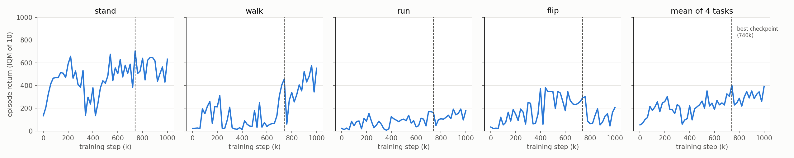

# Reproduction: official FB on ExORL Walker RND-100k

One run of the authors' FB code (`main_exorl.py fb`) on the ExORL `walker` / `rnd` dataset,
subsampled to 100k transitions, evaluated zero-shot on `stand`, `walk`, `run` and `flip`.
The authors publish no checkpoints (no GitHub releases or tags; their best model only went to
their own wandb), so the model was trained here.

## Result

lab job `zsrl-5`, seed 42, idlab1 GPU 1 (RTX 5090), 1M steps in 2 h 13 min (124.7 it/s,
including 51 evaluations). Each number is the IQM of 10 rollouts of 1000 steps.

| | stand | walk | run | flip | mean |
|---|---|---|---|---|---|
| step 0 (untrained) | 134 | 23 | 22 | 34 | 53 |
| step 740k (best checkpoint) | 704 | 457 | 161 | 292 | 403 |
| step 1M (final) | 632 | 553 | 177 | 206 | 392 |
| paper, FB (Table 6) | 558 (498–637) | 184 (123–278) | 101 (90–135) | 163 (90–212) | 252 |
| paper, VC-FB (Table 6) | 624 (604–639) | 446 (435–460) | 179 (165–197) | 325 (292–350) | 394 |

The paper's numbers are from Table 6 of [arXiv:2309.15178](https://arxiv.org/abs/2309.15178)
(Rnd-100k, Walker): the step at which the all-task IQM averaged over 5 seeds is highest,
with 95% bootstrap intervals. The paper's mean column is the plain mean of its four task scores.

- This run scores above the paper's FB on all four tasks, at both the best and the final
  step, and above its 95% interval on each task. It is closer to the paper's VC-FB.
- The cause is not established. The hyperparameters match the paper's Table 4. Differences
  from the paper's runs: one seed instead of five, the best step is chosen per run rather
  than on the 5-seed average, torch 2.7.1 instead of 2.1.0, and the authors changed the FB
  network sizes in `config.yaml` after publication (commit `8083688`, Jan 2025, now equal to
  Table 4). More seeds are needed before calling the result reproduced or not.
- Returns fluctuate strongly between evaluations: after 200k steps the mean IQM ranges from
  59 (340k) to 403 (740k). The best checkpoint is selected on the evaluation tasks
  themselves, so its 403 is biased upward. The final-step 392 has no such selection.



Dashed line: best checkpoint (740k). Data: `zsrl-5_eval.csv`, extracted from the job log.

## Artifacts

| What | Where |
|---|---|
| Best checkpoint (step 740k, whole pickled `FB` agent, 188 MB) | `idlab1:/home/sam/zsrl-runs/zsrl-5/740000.pickle` (sha256 `bffcc5b0…6775`) |
| Full job log | `idlab1:/home/sam/zsrl-runs/zsrl-5/output.log` |
| Eval history | `reproduction/zsrl-5_eval.csv` |
| Training curves | `reproduction/fb_walker_rnd_curves.png` |
| Dataset (10,000 episodes, 10M transitions) | `~/zsrl-datasets/walker/rnd/dataset.npz` on idlab and idlab1 |

## Procedure

All commands run from the repository root, on branch `lab-repro` of
`github.com/novis10813/zero-shot-rl`. `lab run` executes the pushed commit.

1. Environment. `uv sync` installs Python 3.9 and the pinned packages from `pyproject.toml`
   (lab runs it before every job).
2. Dataset. Download the ExORL zip (2.6 GB) and merge it into one `.npz`, outside the job's
   worktree so later jobs can reuse it:

   ```bash
   lab run --server idlab1 --vram 0 -- 'D=$HOME/zsrl-datasets/walker/rnd; \
     uv run python -u exorl_reformatter.py walker_rnd && mkdir -p $D && \
     mv datasets/walker/rnd/dataset.npz $D/'
   ```

3. Train. 1M steps; every 20k steps it evaluates and logs `Step <i> eval: ...` with each
   task's IQM; the best model by mean IQM is kept in
   `agents/fb/saved_models/local-run-*/<step>.pickle`:

   ```bash
   lab run --server idlab1 --vram 16G -- 'PYTHONUNBUFFERED=1 uv run python main_exorl.py \
     fb walker rnd --eval_tasks stand walk run flip --wandb_logging False \
     --dataset_path $HOME/zsrl-datasets/walker/rnd/dataset.npz'
   ```

   Run on a GPU no other job is using: the same job on a shared GPU fell to about 7 it/s.
   Peak VRAM is about 8.4 GB, mostly from loading all 10M transitions onto the GPU
   before subsampling 100k.

4. Re-evaluate a checkpoint with the same protocol:

   ```bash
   uv run python eval_exorl.py <checkpoint.pickle> walker \
     --dataset_path $HOME/zsrl-datasets/walker/rnd/dataset.npz \
     --eval_tasks stand walk run flip --eval_rollouts 10
   ```

   The scores differ slightly from the in-training evaluation, because the 10k transitions
   used to infer z and the environment's random state are different.

5. Curves:

   ```bash
   uv run python reproduction/plot_curves.py reproduction/zsrl-5_eval.csv \
     --best_step 740000 -o reproduction/fb_walker_rnd_curves.png
   ```

### Evaluation protocol (unchanged from the authors)

For each task, z is inferred as `√d · normalize(E[r · B(s)])` over 10,000 random buffer
transitions relabelled with that task's reward. The policy acts deterministically for
1000 steps, and the score is the IQM (`scipy.stats.trim_mean(·, 0.25)`) of 10 rollouts.

### Changes to the authors' code

| Change | Why |
|---|---|
| `pyproject.toml` + `uv.lock`: Python 3.9, torch 2.7.1 (CUDA 12.8), `setuptools<70`; other pins as in `requirements.txt`, minus the unused `gcloud` and `pylint` | torch 2.1.0 does not support Blackwell GPUs (sm_120). wandb 0.15.2 imports `pkg_resources` |
| `main_exorl.py --dataset_path` | read the dataset from outside the job's worktree |
| `agents/workspaces.py`: keep the best checkpoint after training | the original deletes it unless it was uploaded to wandb |
| `agents/workspaces.py`: log every evaluation's per-task IQM | without wandb, per-task scores were not recorded |
| `eval_exorl.py` (new) | re-evaluate a saved checkpoint |

FB losses, the agent and the evaluation are unchanged.

## Comparison with fb-offline

`github.com/novis10813/fb-offline` (our FB baseline, runs fb-41/42/43).

| | Official FB (this run) | fb-offline |
|---|---|---|
| Benchmark | DeepMind Control `walker`, ExORL RND exploration data, 100k of 10M transitions | Gym MuJoCo `walker2d`, Minari `mujoco/walker2d/medium-v0` (1M transitions from a medium SAC policy) |
| Tasks | 4 rewards relabelled from physics (stand, walk, run, flip) | 1, the environment reward |
| Actor loss | `−min(Q1, Q2)`, no behaviour cloning | TD3+BC, α = 1.0. Without it FB diverges on walker2d-medium (fb-3) |
| Networks | F: (s, a) and (s, z) preprocessors with 2 hidden layers of 1024 → 512, then 2 hidden layers of 1024. B: 3 hidden layers of 256. ReLU only | F: embeddings with 1 hidden layer of 1024 → 512, then a 1024-wide head. B: 2 hidden layers of 256. First layer Linear → LayerNorm → Tanh |
| Observation normalisation | none | dataset mean / std |
| Batch size | 512 | 1024 |
| Shared settings | d = 50, lr 1e-4, γ 0.98, Polyak 0.01, z mix 0.5, orthonormality weight 1, target noise 0.2 clipped at 0.3, 1M steps | same |
| z inference | `E[r B(s)]` on 10k relabelled buffer samples, scaled to √d | `E[r B(s')]` on dataset rewards, scaled to √d (`raw` z_r) |
| Reported score | IQM of 10 rollouts at the best evaluation step, chosen on the test tasks | mean ± std of 10 episodes at the final 1M checkpoint, 3 seeds |
| Result | mean 392 at 1M (DMC returns are in [0, 1000]) | 5990 ± 48 (raw z_r; dataset return 5702) |

- The returns are not comparable: different simulators, data and reward scales.
- Both show unstable in-training performance. fb-offline's π(·, z_r) starts falling at
  80k–120k and walks reliably again only from 500k–560k. Here the mean IQM drops to 59 at 340k.
- FB loss curves were not recorded for this run (they are only logged to wandb), so it is
  not known whether the official FB's losses stay bounded on RND-100k. Its returns did not
  collapse without behaviour cloning, whereas vanilla FB in fb-offline diverged on
  walker2d-medium.
