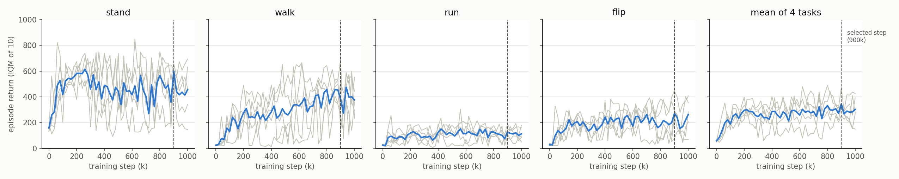

# Reproduction: official FB on ExORL Walker RND-100k

Five seeds of the authors' FB code (`main_exorl.py fb`) on the ExORL `walker` / `rnd`
dataset, subsampled to 100k transitions, evaluated zero-shot on `stand`, `walk`, `run` and
`flip`. The authors publish no checkpoints (no GitHub releases or tags; their best model only
went to their own wandb), so the models were trained here.

## Result

Seeds 42, 0, 1, 2, 3 (lab jobs `zsrl-5`, `-6`, `-7`, `-12`, `-13`), all on idlab1 GPU 1
(RTX 5090), 1M steps each. Every 20k steps each task is scored as the IQM of 10 rollouts of
1000 steps. Aggregated as in the paper's Table 6: the step with the highest all-task IQM over
the 5 seeds is selected, and each task's IQM over seeds at that step is reported with a 95%
stratified-bootstrap interval (`rliable`, 10,000 resamples).

| | stand | walk | run | flip | mean of 4 |
|---|---|---|---|---|---|
| this reproduction, selected step (900k) | 601 (560–643) | 362 (169–639) | 120 (84–178) | 276 (135–396) | 340 |
| this reproduction, final step (1M) | 480 (212–674) | 366 (273–516) | 112 (62–171) | 281 (114–389) | 310 |
| paper, FB (Table 6) | 558 (498–637) | 184 (123–278) | 101 (90–135) | 163 (90–212) | 252 |
| paper, VC-FB (Table 6) | 624 (604–639) | 446 (435–460) | 179 (165–197) | 325 (292–350) | 394 |

Paper numbers: Table 6 of [arXiv:2309.15178](https://arxiv.org/abs/2309.15178), Rnd-100k,
Walker. "Mean of 4" is the plain mean of the four task scores in both rows. The all-task IQM
over seeds and tasks is 325 (240–408) at the selected step and 282 (216–354) at 1M.

- On every task the 95% interval of this reproduction overlaps the paper's FB interval.
  stand and run are close to the paper. walk (362 vs 184) and flip (276 vs 163) are higher,
  with wide intervals: walk spans 169–639 across seeds.
- Each seed's own best step scores far above the 5-seed result (mean of 4 tasks 397–488,
  seed 42: 403), because each run picks its luckiest evaluation. That is why the first
  single-seed run looked closer to VC-FB.
- Returns fluctuate strongly between evaluations and between seeds (grey lines below).
  Selecting the step on the evaluation tasks biases the selected-step row upward. The
  final-step row has no such selection.
- Remaining differences from the paper's setup: different seeds, torch 2.7.1 instead of
  2.1.0, and the authors changed the FB network sizes in `config.yaml` after publication
  (commit `8083688`, Jan 2025, now equal to the paper's Table 4).



Grey: each seed. Blue: mean over seeds. Dashed line: selected step (900k). Data:
`zsrl-<job>_eval.csv`, extracted from each job log. Regenerate the table and figure with:

```bash
cd reproduction && uv run python aggregate_seeds.py zsrl-5_eval.csv zsrl-6_eval.csv \
  zsrl-7_eval.csv zsrl-12_eval.csv zsrl-13_eval.csv -o fb_walker_rnd_5seeds.png
```

## Artifacts

Each run keeps only its own best checkpoint (highest mean IQM in that run), not the
5-seed selected step.

| Seed | Job | Wall time | Best checkpoint (whole pickled `FB` agent, 188 MB) | Eval history |
|---|---|---|---|---|
| 42 | zsrl-5 | 2 h 14 min, alone on the GPU | `idlab1:/home/sam/zsrl-runs/zsrl-5/740000.pickle` | `zsrl-5_eval.csv` |
| 0 | zsrl-6 | 4 h 56 min, 2 jobs on the GPU | `idlab1:/home/sam/zsrl-runs/zsrl-6/800000.pickle` | `zsrl-6_eval.csv` |
| 1 | zsrl-7 | 4 h 56 min, 2 jobs on the GPU | `idlab1:/home/sam/zsrl-runs/zsrl-7/680000.pickle` | `zsrl-7_eval.csv` |
| 2 | zsrl-12 | 3 h 12 min, 2 jobs on the GPU | `idlab1:/home/sam/zsrl-runs/zsrl-12/200000.pickle` | `zsrl-12_eval.csv` |
| 3 | zsrl-13 | 3 h 7 min, partly shared | `idlab1:/home/sam/zsrl-runs/zsrl-13/560000.pickle` | `zsrl-13_eval.csv` |

Full job logs sit next to each checkpoint (`output.log`). The dataset (10,000 episodes, 10M
transitions) is at `~/zsrl-datasets/walker/rnd/dataset.npz` on idlab and idlab1. The
single-seed figure for seed 42 is `fb_walker_rnd_curves.png` (`plot_curves.py`).

## Procedure

All commands run from the repository root, on branch `lab-repro` of
`github.com/novis10813/zero-shot-rl`. `lab run` executes the pushed commit.

1. Environment. `uv sync` installs Python 3.9 and the pinned packages from `pyproject.toml`
   (lab runs it before every job).
2. Dataset. Download the ExORL zip (2.6 GB) and merge it into one `.npz`, outside the job's
   worktree so later jobs can reuse it:

   ```bash
   lab run --server idlab1 --vram 0 -- 'D=$HOME/zsrl-datasets/walker/rnd; \
     uv run python -u exorl_reformatter.py walker_rnd && mkdir -p $D && \
     mv datasets/walker/rnd/dataset.npz $D/'
   ```

3. Train. 1M steps; every 20k steps it evaluates and logs `Step <i> eval: ...` with each
   task's IQM; the best model by mean IQM is kept in
   `agents/fb/saved_models/local-run-*/<step>.pickle`:

   ```bash
   lab run --server idlab1 --vram 16G -- 'PYTHONUNBUFFERED=1 uv run python main_exorl.py \
     fb walker rnd --eval_tasks stand walk run flip --wandb_logging False \
     --dataset_path $HOME/zsrl-datasets/walker/rnd/dataset.npz'
   ```

   Add `--seed <s>` for other seeds (the 100k subsample is fixed by `rng(42)` regardless).
   Two of these jobs fit on one idle 32 GB GPU at about 60 it/s each. On a GPU saturated by
   other users' jobs the same run fell to about 7 it/s.
   Peak VRAM is about 8.4 GB, mostly from loading all 10M transitions onto the GPU
   before subsampling 100k.

4. Re-evaluate a checkpoint with the same protocol:

   ```bash
   uv run python eval_exorl.py <checkpoint.pickle> walker \
     --dataset_path $HOME/zsrl-datasets/walker/rnd/dataset.npz \
     --eval_tasks stand walk run flip --eval_rollouts 10
   ```

   The scores differ slightly from the in-training evaluation, because the 10k transitions
   used to infer z and the environment's random state are different.

5. Curves:

   ```bash
   uv run python reproduction/plot_curves.py reproduction/zsrl-5_eval.csv \
     --best_step 740000 -o reproduction/fb_walker_rnd_curves.png
   ```

### Evaluation protocol (unchanged from the authors)

For each task, z is inferred as `√d · normalize(E[r · B(s)])` over 10,000 random buffer
transitions relabelled with that task's reward. The policy acts deterministically for
1000 steps, and the score is the IQM (`scipy.stats.trim_mean(·, 0.25)`) of 10 rollouts.

### Changes to the authors' code

| Change | Why |
|---|---|
| `pyproject.toml` + `uv.lock`: Python 3.9, torch 2.7.1 (CUDA 12.8), `setuptools<70`; other pins as in `requirements.txt`, minus the unused `gcloud` and `pylint` | torch 2.1.0 does not support Blackwell GPUs (sm_120). wandb 0.15.2 imports `pkg_resources` |
| `main_exorl.py --dataset_path` | read the dataset from outside the job's worktree |
| `agents/workspaces.py`: keep the best checkpoint after training | the original deletes it unless it was uploaded to wandb |
| `agents/workspaces.py`: log every evaluation's per-task IQM | without wandb, per-task scores were not recorded |
| `eval_exorl.py` (new) | re-evaluate a saved checkpoint |

FB losses, the agent and the evaluation are unchanged.

## Comparison with fb-offline

`github.com/novis10813/fb-offline` (our FB baseline, runs fb-41/42/43).

| | Official FB (this reproduction) | fb-offline |
|---|---|---|
| Benchmark | DeepMind Control `walker`, ExORL RND exploration data, 100k of 10M transitions | Gym MuJoCo `walker2d`, Minari `mujoco/walker2d/medium-v0` (1M transitions from a medium SAC policy) |
| Tasks | 4 rewards relabelled from physics (stand, walk, run, flip) | 1, the environment reward |
| Actor loss | `−min(Q1, Q2)`, no behaviour cloning | TD3+BC, α = 1.0. Without it FB diverges on walker2d-medium (fb-3) |
| Networks | F: (s, a) and (s, z) preprocessors with 2 hidden layers of 1024 → 512, then 2 hidden layers of 1024. B: 3 hidden layers of 256. ReLU only | F: embeddings with 1 hidden layer of 1024 → 512, then a 1024-wide head. B: 2 hidden layers of 256. First layer Linear → LayerNorm → Tanh |
| Observation normalisation | none | dataset mean / std |
| Batch size | 512 | 1024 |
| Shared settings | d = 50, lr 1e-4, γ 0.98, Polyak 0.01, z mix 0.5, orthonormality weight 1, target noise 0.2 clipped at 0.3, 1M steps | same |
| z inference | `E[r B(s)]` on 10k relabelled buffer samples, scaled to √d | `E[r B(s')]` on dataset rewards, scaled to √d (`raw` z_r) |
| Reported score | IQM of 10 rollouts at the best evaluation step, chosen on the test tasks | mean ± std of 10 episodes at the final 1M checkpoint, 3 seeds |
| Result | mean of 4 tasks 310 at 1M, 5 seeds (DMC returns are in [0, 1000]) | 5990 ± 48 (raw z_r; dataset return 5702) |

- The returns are not comparable: different simulators, data and reward scales.
- Both show unstable in-training performance. fb-offline's π(·, z_r) starts falling at
  80k–120k and walks reliably again only from 500k–560k. Here seed 42's mean IQM drops to 59 at 340k.
- FB loss curves were not recorded for these runs (they are only logged to wandb), so it is
  not known whether the official FB's losses stay bounded on RND-100k. Its returns did not
  collapse without behaviour cloning, whereas vanilla FB in fb-offline diverged on
  walker2d-medium.
