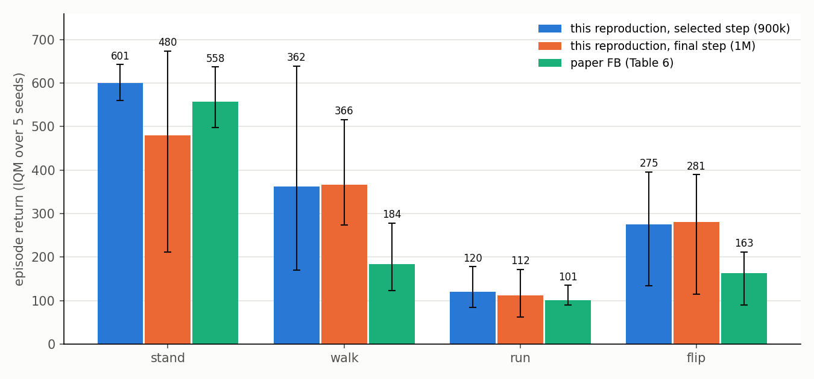

# 官方 FB 重現報告：ExORL Walker RND-100k

結論：用作者原始程式碼訓練 5 個 seed，四個任務的 95% 信賴區間都與論文 FB（Table 6）重疊。stand 和 run 接近論文，walk 和 flip 較高，但跨 seed 變異很大。

重現步驟、指令與程式碼修改見 [`README.md`](README.md)。

- 論文：Jeen et al., *Zero-Shot Reinforcement Learning from Low Quality Data*, NeurIPS 2024, [arXiv:2309.15178](https://arxiv.org/abs/2309.15178)

## 實驗設定

| 項目 | 設定 |
|---|---|
| 資料集 | ExORL `walker` / `rnd`（10,000 episodes、10M transitions），以固定 `rng(42)` 抽樣 100k transitions |
| 任務 | `stand`、`walk`、`run`、`flip`，零樣本評估，reward 由 physics 重新標註 |
| 架構 | F：(s, a) 與 (s, z) preprocessor（2 層 1024 → 512），接 2 層 1024。B：3 層 256。Actor：2 層 1024。ReLU |
| 超參數 | z 維度 50、batch 512、lr 1e-4、γ 0.98、Polyak 0.01、z mix 0.5、orthonormality 1、policy smoothing σ 0.2 / clip 0.3，與論文 Table 4 一致 |
| 訓練 | 1M gradient steps，seed 42、0、1、2、3 |
| 評估 | 每 20k 步一次。z = √d · normalize(E[r · B(s)])，用 10k 筆 buffer 樣本推得。每個任務 10 個 rollout × 1000 步，取 IQM |
| 彙整 | 與論文 Table 6 相同：選 5 個 seed 全任務 IQM 最高的那一步，回報該步各任務在 5 個 seed 上的 IQM，95% stratified bootstrap 信賴區間（`rliable`，10,000 次重抽） |
| 硬體 | RTX 5090。單獨跑一個 job 約 2.2 小時（125 it/s），兩個 job 共用一張 GPU 時各約 3 到 5 小時。VRAM 峰值約 8.4 GB |

## 結果

**表 1：各任務 IQM（括號為 95% 信賴區間）**

| | stand | walk | run | flip | 4 任務平均 |
|---|---|---|---|---|---|
| 本次重現，選定步數（900k） | 601 (560–643) | 362 (169–639) | 120 (84–178) | 275 (135–396) | 340 |
| 本次重現，最後一步（1M） | 480 (212–674) | 366 (273–516) | 112 (62–171) | 281 (114–389) | 310 |
| 論文 FB（Table 6） | 558 (498–637) | 184 (123–278) | 101 (90–135) | 163 (90–212) | 252 |

圖 1：各任務在 5 個 seed 上的 IQM。誤差線為 95% 信賴區間，論文數據取自 Table 6。

圖 2：每 20k 步的評估分數（每個 rollout 組取 10 次的 IQM）。灰線為各 seed，藍線為 5 個 seed 的平均，虛線為選定步數（900k）。

- 分數在不同評估時點與不同 seed 之間波動很大，walk 在 900k 的區間是 169 到 639。
- 選定步數是用評估任務本身挑的，所以第一列會偏高。最後一步那列沒有這種選擇偏差。
- 每個 seed 若各自挑最好的一步，4 任務平均落在 397 到 488，明顯高於 5 個 seed 的彙整結果，所以單一 seed 的結果不能直接拿來和論文比。

## 與 fb-offline 的比較

兩邊的分數不能直接比較，因為模擬器、資料和 reward 尺度都不同。DMC 的回報落在 0 到 1000，Gym walker2d 約 6000。

**表 2：實作差異**

| | 官方 FB | fb-offline |
|---|---|---|
| Benchmark | DMC `walker`，ExORL RND 探索資料，100k | Gym `walker2d`，Minari `medium-v0`，1M |
| 任務 | 4 個重新標註的 reward | 1 個，環境 reward |
| Actor loss | `−min(Q1, Q2)`，沒有 BC | TD3+BC，α = 1.0（沒有 BC 會發散） |
| 網路 | B 為 3 層 256，全部 ReLU | B 為 2 層 256，第一層 LayerNorm → Tanh |
| 觀測值正規化 | 無 | 用資料集的 mean / std |
| Batch | 512 | 1024 |
| 共同設定 | d = 50、lr 1e-4、γ 0.98、Polyak 0.01、z mix 0.5、orthonormality 1、σ 0.2 / clip 0.3、1M 步 | 相同 |
| 回報方式 | 評估最佳步數的 IQM，5 seeds | 1M 最後一步，10 episodes 的 mean ± std，3 seeds |
| 結果 | 4 任務平均 310（1M） | 5990 ± 48（raw z_r） |

- 官方 FB 沒有 BC 項，在 RND-100k 上回報沒有崩潰。fb-offline 的 vanilla FB 在 walker2d-medium 上會發散。差別可能來自資料覆蓋度（探索資料相對於單一策略資料），但這一點沒有驗證。
- 兩者的訓練過程都不穩定。fb-offline 在 80k 到 560k 之間會跌倒，官方 FB 的評估分數也大幅跳動（圖 2）。
- 官方 FB 的 loss 只會記錄到 wandb，這次沒有開，所以無法確認它的 loss 是否保持有界。

## 限制

- 只做了 Walker / RND-100k，其他 domain 和資料集沒有跑。
- 使用的 seed 和論文不同，且 torch 版本從 2.1.0 換成 2.7.1。
- 作者在論文發表後修改過 FB 的網路大小（commit `8083688`），目前的值與論文 Table 4 一致。
